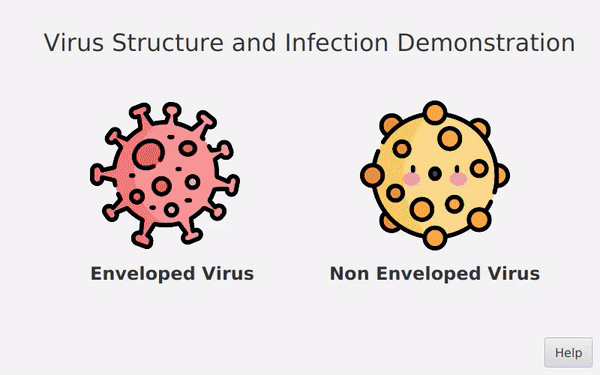

# OOP.20232.21 

<div align="center">

# Topic 7: Demonstration of types of viruses and its mechanism

</div>

<div align="center">

[](https://opensource.org/licenses/MIT)


<p>  </p>


<p>  </p>

</div>

# Overeview 📝
The global spread of COVID-19 has underscored the importance of understanding various types of viruses and their modes of transmission. This knowledge is fundamental in devising effective prevention strategies. Motivated by this need, our team has developed this JavaFX project.

# Installation ⚒️


**1. Clone the repository**
```bash
git clone https://github.com/chutrunganh/OOP.20232.21.git
```
**2. Install dependencies**

Ensure that your system is equipped with the Java JDK, specifically version 9.0 or above, and corresponding JavaFX version t. It is also crucial to add the VM option to your IDE to ensure proper functionality:
```plaintext
--module-path ${PATH_TO_FX} --add-modules javafx.controls,javafx.fxml,javafx.media
```
*Replace ${PATH_TO_FX} with the actual path to the `lib` directory of JavaFX in your machine.*

Upon successful completion of the above steps, you are prepared to commence exploration of the project.


# Features 🕹️

- Choose from various types of viruses for a focused study

- View the detailed structure of a specific virus to understand its composition

- Examine the detailed infection mechanism of a specific virus to learn how it operates in text and video.

For more information about these features, click on the `help` button or refer to our [Use Case Diagram](https://github.com/chutrunganh/OOP.20232.21/blob/master/design/Use%20case%20Diagram/usecase.png
). 


# Contributors 🤝

We would like to express our gratitude to the following contributors:

- Project Advisor: **Nguyen Thi Thu trang**
- Team Members:
    - **Chu Trung Anh** 20225564 : README file, virus package
    - **Phan Tran viet Bach** 20225435 : Present, virus package
    - **Nguyen Huu Cong** 20225476 : Report, diagram, gui package
    


