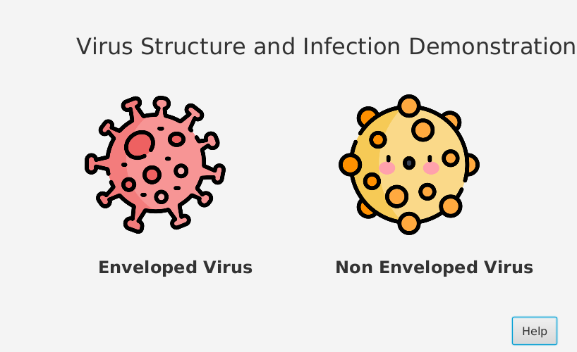
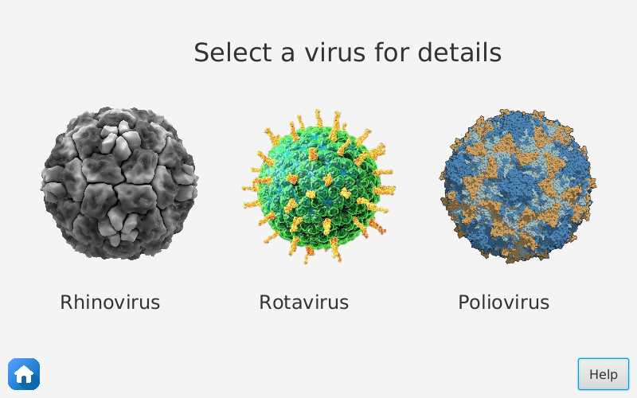
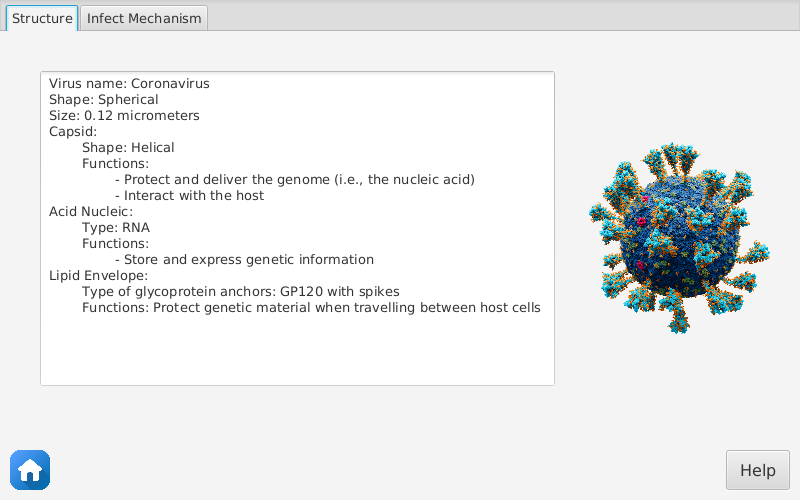
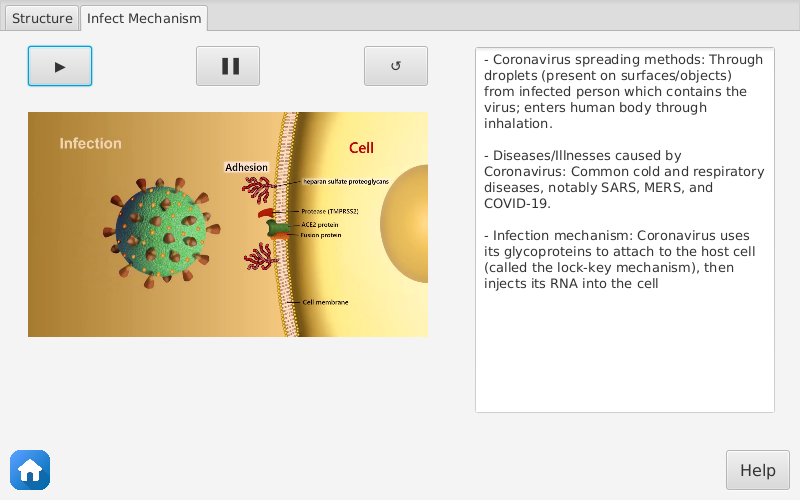
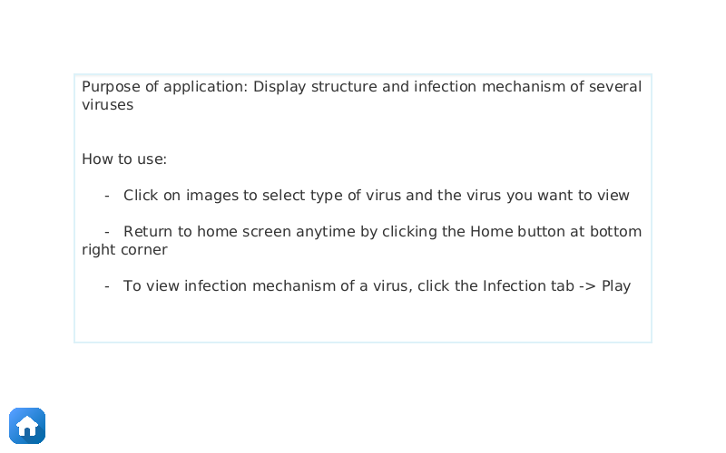

# OOP.20232.21 

<div align="center">

# Topic 7: Demonstration of types of viruses and its mechanism

</div>

<div align="center">

[](https://opensource.org/licenses/MIT)
 


<p>  </p>


<p>  </p>

</div>

# 📝 Overeview 
The global spread of COVID-19 has underscored the importance of understanding various types of viruses and their modes of transmission. This knowledge is fundamental in devising effective prevention strategies. Motivated by this need, our team has developed this Java project.

# 📌 Features 

- **Choose a virus to view its detailed information:**




<br>



- **View the structure (text format) and infection mechanism (text + video format) of a virus:**



<br>


*Currently, the video display feature may not work properly on some platforms when running from the jar file. Please refer to the [installation section](#-installation-) for more information.*

- **Help menu to guide users through the application:**




# ⚒️ Installation 

You can experience the application by simply downloading and running the `jar` file from the [release page](https://github.com/chutrunganh/OOP.20232.21/releases/) (require Java version 23 or newer).
However, this jar file encounters some problems when display mp4 format videos on certain platforms, so the video may not display, but other features will still work properly.

With the jar file, you can double-click to run the application if your system supports it. Otherwise, you can run the following command in the terminal:

```bash
java -jar VirusExplorer.jar
```
Just ignore the warning and error messages related to video display, you can still use the application with other features.

For full exploration of the project without video display error, we recommend running the project from the source code.

## Build from source

**1. Clone the repository**
```bash
git clone https://github.com/chutrunganh/OOP.20232.21.git
```
**2. Install dependencies**

Ensure that your system is equipped with the JDK of version 8.0 or above and corresponding JavaFX version. 
JavaFX SDK can be downloaded from the [official website](https://gluonhq.com/products/javafx/).

> [!IMPORTANT]  
> The latest Java version tested for this project is 23, on Fedora Workstation 41. If you encounter any errors due to version incompatibility, adjust the settings in File -> Project Structure -> Project -> SDK, Module -> Language Level,
> and the version specified in the `pom.xml` file to a suitable, consistent version.


**3. Run the project**

On the IDE navigation bar, select `Run` -> `Edit Configurations` -> `Add New Configuration` -> `Application`.
Choose either `Main.java` or `MainToPackage.java` as the main class of the project.

Click on `Modify Options` -> `Add VM options` to ensure proper functionality:

```plaintext
--module-path ${PATH_TO_FX} --add-modules javafx.controls,javafx.fxml,javafx.media
```
*Replace ${PATH_TO_FX} with the actual path to the `lib` directory of JavaFX in your machine, for example:*
```plaintext
--module-path /home/chutrunganh/Downloads/openjfx-23.0.2_linux-x64_bin-sdk/javafx-sdk-23.0.2/lib --add-modules javafx.controls,javafx.fxml,javafx.media
```

Upon successful completion of the above steps, you are prepared to commence exploration of the project.


# 🤝 Contributors

We would like to express our gratitude to the following contributors:

- Project Advisor: **PhD. Nguyen Thi Thu Trang**
- Team Members:

  | Team Members | ID | Package Virus | Package GUI | README | Slide | Report | Diagram |
  | --- | --- | --- | --- | --- | --- | --- | --- |
  | Chu Trung Anh (leader) | 20225564 | 20% | 40% | 50% | 20% | 30% | 30% |
  | Phan Tran Viet Bach | 20225435 | 60% | 20% | 20% | 30% | 50% | 40% |
  | Nguyen Huu Cong | 20225476 | 20% | 40% | 30% | 50% | 20% | 30% |


